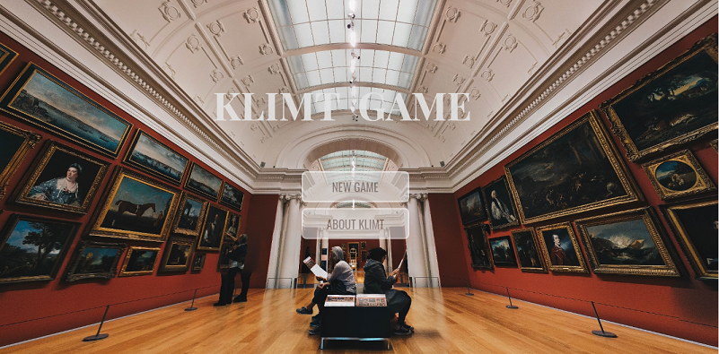
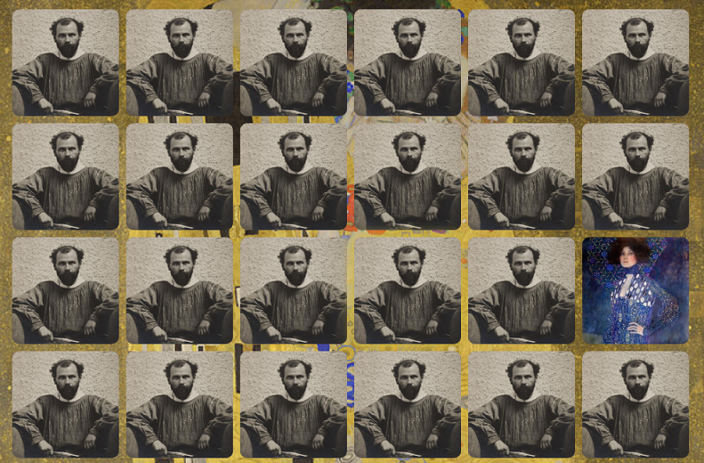

# Memory-Game-Klimt

## Table of contents
* [General info](#general-info)
* [Screenshots](#screenshots)
* [Technologies](#technologies)
* [Setup](#setup)
* [Status](#status)
* [Inspiration](#inspiration)

## General info
My project is memory game. My the biggest motivation is developing skills in JavaScript, jQuery, CSS and HTML. Besides, I used Klimt's paintings as he is an important artist for me. 

## Screenshots
;
;

## Technologies
* HTML5
* CSS3 
* JavaScript 
* jQuery

## Setup
Click in link and enjoy.
https://igor27g.github.io/Memory-Game-Klimt/

To-do list:
* Add pop-up after winning game 
* Add clock which measures time how long you play

## Status
Project is: _in progress_.

## Inspiration
Add here credits. Project based on article: www.taniarascia.com/how-to-create-a-memory-game-super-mario-with-plain-javascript.

